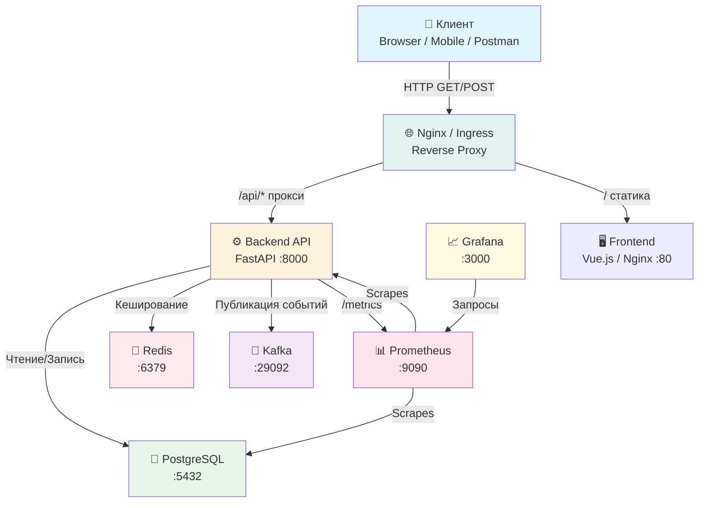
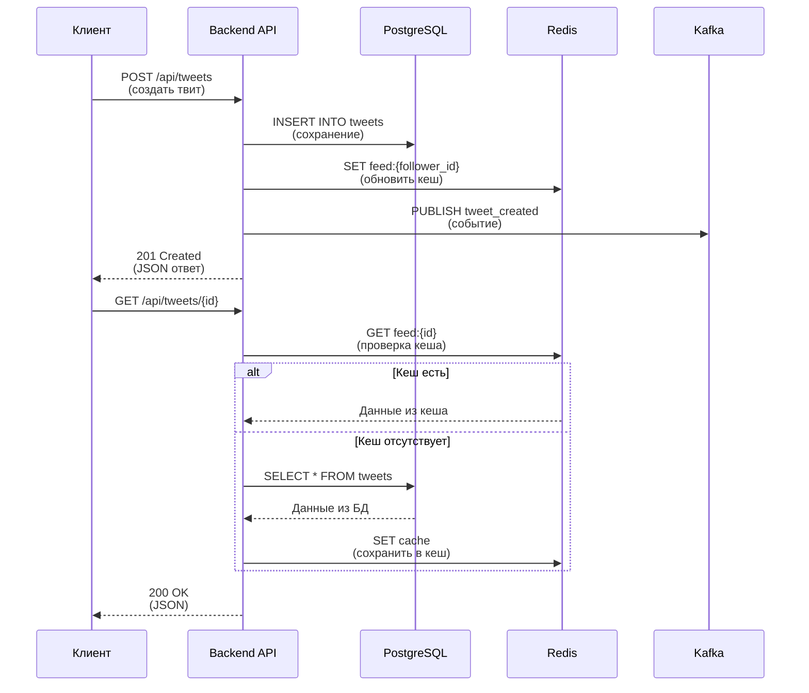
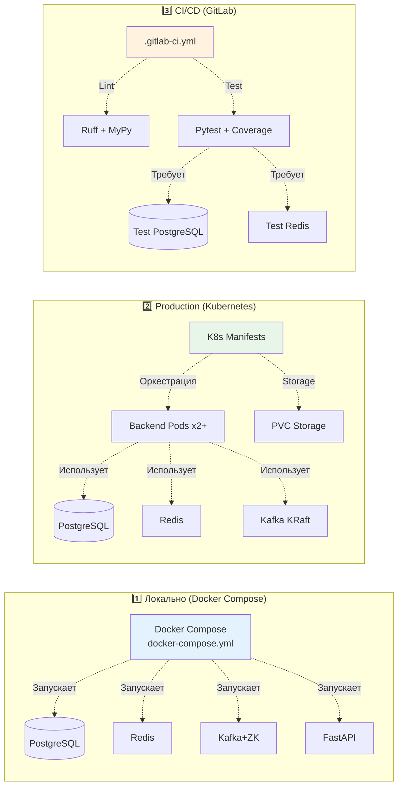

# 🐦 Twitter Clone 2026 — Микросервисный Backend

> **Полнофункциональный клон Twitter** с микросервисной архитектурой, контейнеризацией и оркестрацией в Kubernetes. Проект демонстрирует современные практики DevOps, разработки и эксплуатации: асинхронный FastAPI, Kafka, Redis, PostgreSQL, Prometheus, Grafana, CI/CD готовность и нагрузочное тестирование.

---

## 📖 Содержание

- [О Проекте](#-о-проекте)
- [Схема Базы Данных](#-схема-базы-данных)
- [Архитектура Приложения](#-архитектура-приложения)
  - [Вариант 1: Локальное развертывание (Docker Compose)](#вариант-1-локальное-развертывание-docker-compose)
  - [Вариант 2: Production (Kubernetes)](#вариант-2-production-kubernetes)
  - [Вариант 3: С Frontend (полный стек)](#вариант-3-с-frontend-полный-стек)
- [Зачем Нужны Эти Технологии](#-зачем-нужны-эти-технологии)
  - [Docker](#docker)
  - [Kubernetes](#kubernetes)
  - [Apache Kafka](#apache-kafka)
  - [Redis](#redis)
  - [PostgreSQL](#postgresql)
- [Технологический Стек](#-технологический-стек)
- [API Endpoints](#-api-endpoints)
- [Предварительные Требования](#-предварительные-требования)
- [Быстрый Старт (Docker Compose)](#-быстрый-старт-docker-compose)
- [Production Развертывание (Kubernetes)](#-production-развертывание-kubernetes)
- [Полное Руководство по Тестированию](#-полное-руководство-по-тестированию)
  - [Тестирование локально (Docker Compose)](#тестирование-локально-docker-compose)
  - [Тестирование в Kubernetes](#тестирование-в-kubernetes)
  - [Тестирование с Frontend](#тестирование-с-frontend)
- [Мониторинг и Наблюдаемость](#-мониторинг-и-наблюдаемость)
- [Нагрузочное Тестирование](#-нагрузочное-тестирование)
- [Безопасность](#-безопасность)
- [Плюсы и минусы архитектуры](#-плюсы-и-минусы-архитектуры)
- [Проверка конфигурации](#-проверка-конфигурации)
- [Развёртывание с нуля — пошаговая проверка](#-развёртывание-с-нуля--пошаговая-проверка)
- [CI/CD и Качество Кода](#-cicd-и-качество-кода)
- [Управление Жизненным Циклом](#-управление-жизненным-циклом)
  - [Как удалить и пересобрать с нуля](#как-удалить-и-пересобрать-с-нуля)
- [Устранение Неполадок](#-устранение-неполадок)
- [Структура Проекта](#-структура-проекта)
- [Для Работодателей](#-для-работодателей)

---

## 🎯 О Проекте

Этот проект — **полноценный backend для клона Twitter**, разработанный как дипломная работа курса "Python Advanced" от Skillbox. 

**Архитектура:** Это **модульный монолит** (modular monolith), а не классические микросервисы. Весь код упакован в одном контейнере Docker, но разделён на логические модули (users, tweets, feed), что облегчает разработку и тестирование. Для production рекомендуется эволюция в настоящую микросервисную архитектуру.

Он демонстрирует:

| Навык | Реализация |
|-------|------------|
| **Модульный монолит** | Разделение на модули (users, tweets, feed) в одном контейнере — легче для локальной разработки |
| **Асинхронность** | FastAPI + asyncpg + redis-py (async) |
| **Очереди сообщений** | Apache Kafka для асинхронной обработки событий |
| **Кэширование** | Redis для ускорения отдачи ленты |
| **Контейнеризация** | Multi-stage Docker builds |
| **Оркестрация** | Kubernetes манифесты + Helm |
| **Мониторинг** | Prometheus + Grafana + ServiceMonitor |
| **Нагрузочное тестирование** | Locust сценарии |
| **Безопасность** | Non-root контейнеры, Secrets, SecurityContext |
| **Качество кода** | Ruff, MyPy, Pytest, Bandit |

---

## 🏛️ Общая Архитектура (Mermaid)



### 🔀 Потоки данных



### 🗺️ Варианты Развертывания



---

## 🗄 Схема Базы Данных

### ER-диаграмма PostgreSQL

```
┌─────────────────────────────────────────────────────────────────────────────┐
│                              PostgreSQL Database                             │
│                              twitter_clone_db                                │
├─────────────────────────────────────────────────────────────────────────────┤
│                                                                             │
│  ┌──────────────────┐         ┌──────────────────┐                          │
│  │     users        │         │    followers     │                          │
│  ├──────────────────┤         ├──────────────────┤                          │
│  │ 🔑 id (PK)       │◄──┐  ┌──│ 🔑 follower_id   │                          │
│  │    name          │   │  │   │    (FK→users)    │                          │
│  │    api_key (UQ)  │   │  │   │ 🔑 followed_id   │                          │
│  └────────┬─────────┘   │  │   │    (FK→users)    │                          │
│           │             │  │   └──────────────────┘                          │
│           │             │  │                                                 │
│           │             └──┼── Many-to-Many ─────────────────────────────┐   │
│           │                │                                              │   │
│           ▼                ▼                                              │   │
│  ┌──────────────────┐         ┌──────────────────┐                        │   │
│  │     tweets       │         │      likes       │                        │   │
│  ├──────────────────┤         ├──────────────────┤                        │   │
│  │ 🔑 id (PK)       │◄──┐  ┌──│ 🔑 user_id       │                        │   │
│  │    content       │   │  │   │    (FK→users)    │                        │   │
│  │    author_id     │   │  │   │ 🔑 tweet_id      │                        │   │
│  │    created_at    │   │  │   │    (FK→tweets)   │                        │   │
│  │    updated_at    │   │  │   └──────────────────┘                        │   │
│  └────────┬─────────┘   │  │                                               │   │
│           │             │  │                                               │   │
│           │             └──┼── One-to-Many ─────────────────────────────┐  │   │
│           │                │                                            │  │   │
│           ▼                ▼                                            │  │   │
│  ┌──────────────────┐         ┌──────────────────┐                      │  │   │
│  │      media       │         │   Relationships   │                      │  │   │
│  ├──────────────────┤         ├──────────────────┤                      │  │   │
│  │ 🔑 id (PK)       │         │ users 1──N tweets │                      │  │   │
│  │    file_path     │         │ users N──M users  │◄── followers table   │  │   │
│  │    tweet_id (FK) │         │ tweets 1──N likes │                      │  │   │
│  │    (nullable)    │         │ users 1──N likes  │                      │  │   │
│  └──────────────────┘         │ tweets 1──N media │                      │  │   │
│                               └──────────────────┘                      │  │   │
└─────────────────────────────────────────────────────────────────────────┼──┼───┘
                                                                        │  │
  ┌─────────────────────────────────────────────────────────────────────┘  │
  │                                                                        │
  │  ┌──────────────────────────────────────────────────────────────────┐  │
  │  │                    Связи между таблицами                          │  │
  │  ├──────────────────────────────────────────────────────────────────┤  │
  │  │                                                                  │  │
  │  │  users ──(1:N)──▶ tweets                                         │  │
  │  │    │                        │                                     │  │
  │  │    │                        └──(1:N)──▶ media                     │  │
  │  │    │                        │                                     │  │
  │  │    │                        └──(1:N)──▶ likes                     │  │
  │  │    │                                      │                       │  │
  │  │    └──────────(1:N)───────────────────────┘                       │  │
  │  │                                                                   │  │
  │  │  users ◄──(N:M)──▶ users  (через followers)                       │  │
  │  │    follower_id ──▶ user who follows                               │  │
  │  │    followed_id ──▶ user being followed                            │  │
  │  │                                                                  │  │
  │  └──────────────────────────────────────────────────────────────────┘  │
  └────────────────────────────────────────────────────────────────────────┘
```

### Описание таблиц

| Таблица | Назначение | Ключевые поля |
|---------|------------|---------------|
| **users** | Пользователи системы | `id` (PK), `name`, `api_key` (unique) |
| **followers** | Подписки (Many-to-Many) | `follower_id` (FK), `followed_id` (FK) |
| **tweets** | Твиты/посты | `id` (PK), `content`, `author_id` (FK), `created_at`, `updated_at` |
| **media** | Медиа-файлы (изображения) | `id` (PK), `file_path`, `tweet_id` (FK, nullable) |
| **likes** | Лайки (Many-to-Many) | `user_id` (FK), `tweet_id` (FK) — составной PK |

---

## 🏗 Архитектура Приложения

### Вариант 1: Локальное развертывание (Docker Compose)

> **Архитектура:** Модульный монолит — все модули (gateway, users, tweets, feed) в **одном контейнере** `app:8000`

```
┌─────────────────────────────────────────────────────────────────────────┐
│                        Ваш компьютер (localhost)                         │
├─────────────────────────────────────────────────────────────────────────┤
│                                                                         │
│  ┌───────────────────────────────────────────────────────────────────┐  │
│  │                     Docker Compose Network                         │  │
│  │                        (app-network)                               │  │
│  │                                                                   │  │
│  │  ┌─────────────┐                                                  │  │
  │  │  │   Browser   │  http://localhost:8000/docs                    │  │
│  │  │  (curl/     │◄───────────────────────────────┐                 │  │
│  │  │  Postman)   │                                │                 │  │
│  │  └─────────────┘                                │                 │  │
│  │                                                  │                 │  │
│  │  ┌───────────────────────────────────────────────▼─────────────┐  │  │
│  │  │                    app:8000                                  │  │  │
│  │  │              ┌─────────────────────┐                         │  │  │
│  │  │              │   FastAPI Gateway   │                         │  │  │
│  │  │              │  (Modular Monolith) │                         │  │  │
│  │  │              │                     │                         │  │  │
│  │  │              │  ┌───────────────┐  │                         │  │  │
│  │  │              │  │ Users Router  │  │                         │  │  │
│  │  │              │  ├───────────────┤  │                         │  │  │
│  │  │              │  │ Tweets Router │  │                         │  │  │
│  │  │              │  └───────────────┘  │                         │  │  │
│  │  │              └──────────┬──────────┘                         │  │  │
│  │  └─────────────────────────┼────────────────────────────────────┘  │  │
│  │                            │                                       │  │
│  │          ┌─────────────────┼─────────────────┐                     │  │
│  │          │                 │                 │                     │  │
│  │          ▼                 ▼                 ▼                     │  │
│  │  ┌──────────────┐  ┌──────────────┐  ┌──────────────┐             │  │
│  │  │  PostgreSQL  │  │    Redis     │  │    Kafka     │             │  │
│  │  │  :5432→5433  │  │  :6379       │  │  :29092      │             │  │
│  │  │              │  │              │  │  →9092 ext   │             │  │
│  │  │ users,tweets │  │   cache      │  │   events     │             │  │
│  │  │ media,likes  │  │  feed:{id}   │  │ tweets-topic │             │  │
│  │  └──────┬───────┘  └──────┬───────┘  └──────┬───────┘             │  │
│  │         │                 │                 │                     │  │
│  │         ▼                 ▼                 ▼                     │  │
│  │  ┌──────────────┐  ┌──────────────┐  ┌──────────────┐             │  │
│  │  │  Volume:     │  │   In-memory  │  │  Zookeeper   │             │  │
│  │  │  postgres_   │  │   storage    │  │  :2181       │             │  │
│  │  │  data        │  │              │  │              │             │  │
│  │  └──────────────┘  └──────────────┘  └──────────────┘             │  │
│  │                                                                   │  │
│  │  ┌─────────────────────────────────────────────────────────────┐  │  │
│  │  │                  Kafdrop :9000                              │  │  │
│  │  │           (Web UI для просмотра Kafka)                      │  │  │
│  │  └─────────────────────────────────────────────────────────────┘  │  │
│  │                                                                   │  │
│  └───────────────────────────────────────────────────────────────────┘  │
│                                                                         │
│  ┌───────────────────────────────────────────────────────────────────┐  │
│  │                    Media Volume (./media)                          │  │
│  │              Загруженные изображения твитов                        │  │
│  └───────────────────────────────────────────────────────────────────┘  │
│                                                                         │
└─────────────────────────────────────────────────────────────────────────┘
```

**Потоки данных:**
```
1. Запрос клиента → FastAPI (порт 8000)
2. FastAPI → PostgreSQL (чтение/запись данных)
3. FastAPI → Redis (кэш ленты, TTL 10 сек)
4. FastAPI → Kafka (публикация событий о новых твитах)
5. Feed Service → Kafka (подписка на события)
```

---

### Вариант 2: Production (Kubernetes)

```
┌─────────────────────────────────────────────────────────────────────────────────┐
│                          Kubernetes Cluster (namespace: twitter-clone)           │
├─────────────────────────────────────────────────────────────────────────────────┤
│                                                                                 │
│  ┌───────────────────────────────────────────────────────────────────────────┐  │
│  │                          Ingress Controller                                │  │
│  │                        (Nginx Ingress :80/:443)                           │  │
│  │                    twitter-clone.local → backend-service                   │  │
│  └───────────────────────────────┬───────────────────────────────────────────┘  │
│                                  │                                              │
│                                  ▼                                              │
│  ┌───────────────────────────────────────────────────────────────────────────┐  │
│  │                        Backend Deployment (2+ реплики)                     │  │
│  │  ┌─────────────────────────────────────────────────────────────────────┐  │  │
│  │  │  Pod 1                          Pod 2                  Pod N        │  │  │
│  │  │  ┌──────────────────┐          ┌──────────────────┐                 │  │  │
│  │  │  │ Init Container:  │          │ Init Container:  │                 │  │  │
│  │  │  │ 1. wait-for-infra│          │ 1. wait-for-infra│                 │  │  │
│  │  │  │ 2. alembic mig   │          │ 2. alembic mig   │                 │  │  │
│  │  │  └──────────────────┘          └──────────────────┘                 │  │  │
│  │  │  ┌──────────────────┐          ┌──────────────────┐                 │  │  │
│  │  │  │ Main Container:  │          │ Main Container:  │                 │  │  │
│  │  │  │ FastAPI :8000    │          │ FastAPI :8000    │                 │  │  │
│  │  │  │ + Kafka Broker   │          │ + Kafka Broker   │                 │  │  │
│  │  │  │ + Redis Client   │          │ + Redis Client   │                 │  │  │
│  │  │  └──────────────────┘          └──────────────────┘                 │  │  │
│  │  │         │                              │                            │  │  │
│  │  └─────────┼──────────────────────────────┼────────────────────────────┘  │  │
│  │            │                              │                               │  │
│  │            ▼                              ▼                               │  │
│  │  ┌─────────────────────────────────────────────────────────────────────┐  │  │
│  │  │                    HPA (Horizontal Pod Autoscaler)                   │  │  │
│  │  │              CPU > 70% → добавляет реплики (max: 5)                 │  │  │
│  │  └─────────────────────────────────────────────────────────────────────┘  │  │
│  └───────────────────────────────────────────────────────────────────────────┘  │
│                                                                                 │
│  ┌───────────────────────────────────────────────────────────────────────────┐  │
│  │                     Infrastructure Services                                │  │
│  │                                                                           │  │
│  │  ┌──────────────┐  ┌──────────────┐  ┌──────────────┐                    │  │
│  │  │  PostgreSQL  │  │    Redis     │  │    Kafka     │                    │  │
│  │  │  Deployment  │  │  Deployment  │  │  Deployment  │                    │  │
│  │  │  :5432       │  │  :6379       │  │  :29092      │                    │  │
│  │  │  1 реплика   │  │  1 реплика   │  │  1 реплика   │                    │  │
│  │  └──────┬───────┘  └──────┬───────┘  └──────┬───────┘                    │  │
│  │         │                 │                 │                             │  │
│  │         ▼                 ▼                 ▼                             │  │
│  │  ┌──────────────┐  ┌──────────────┐  ┌──────────────┐                    │  │
│  │  │   PVC:       │  │   In-memory  │  │  Zookeeper   │                    │  │
│  │  │   postgres-  │  │   storage    │  │  :2181       │                    │  │
│  │  │   pvc        │  │              │  │              │                    │  │
│  │  └──────────────┘  └──────────────┘  └──────────────┘                    │  │
│  │                                                                           │  │
│  │  ┌─────────────────────────────────────────────────────────────────────┐  │  │
│  │  │                    Media PVC (media-pvc)                             │  │  │
│  │  │              Persistent storage для загруженных файлов               │  │  │
│  │  └─────────────────────────────────────────────────────────────────────┘  │  │
│  └───────────────────────────────────────────────────────────────────────────┘  │
│                                                                                 │
│  ┌───────────────────────────────────────────────────────────────────────────┐  │
│  │                     Monitoring Stack                                       │  │
│  │  ┌──────────────────┐         ┌──────────────────┐                        │  │
│  │  │    Prometheus    │◄────────│ ServiceMonitor   │                        │  │
│  │  │  :9090           │  scrapes│ /metrics         │                        │  │
│  │  └────────┬─────────┘         └──────────────────┘                        │  │
│  │           │                                                               │  │
│  │           ▼                                                               │  │
│  │  ┌──────────────────┐                                                     │  │
│  │  │     Grafana      │  Dashboards, Alerts                                 │  │
│  │  │  :3000           │                                                     │  │
│  │  └──────────────────┘                                                     │  │
│  └───────────────────────────────────────────────────────────────────────────┘  │
│                                                                                 │
└─────────────────────────────────────────────────────────────────────────────────┘
```

**Потоки данных в K8s:**
```
1. Внешний запрос → Ingress → backend-service (ClusterIP)
2. backend-service → один из Pod'ов Backend (Round Robin)
3. Backend Pod → postgres-service (ClusterIP) → PostgreSQL Pod
4. Backend Pod → redis-service (ClusterIP) → Redis Pod
5. Backend Pod → kafka-service (ClusterIP) → Kafka Pod
6. Prometheus → ServiceMonitor → scrapes /metrics с каждого Pod
```

---

### Вариант 3: С Frontend (полный стек)

```
┌─────────────────────────────────────────────────────────────────────────────────┐
│                            Полный стек с Frontend                                │
├─────────────────────────────────────────────────────────────────────────────────┤
│                                                                                 │
│  ┌───────────────────────────────────────────────────────────────────────────┐  │
│  │                           Клиентский браузер                               │  │
│  │                        http://twitter-clone.local                         │  │
│  └───────────────────────────────┬───────────────────────────────────────────┘  │
│                                  │                                              │
│                                  ▼                                              │
│  ┌───────────────────────────────────────────────────────────────────────────┐  │
│  │                        Nginx Ingress Controller                            │  │
│  │                                                                           │  │
│  │  Правила маршрутизации:                                                   │  │
│  │  ┌─────────────────────────────────────────────────────────────────────┐  │  │
│  │  │  /          → frontend-service (статические файлы Vue.js)           │  │  │
│  │  │  /api/*     → backend-service (FastAPI API)                         │  │  │
│  │  │  /api/docs  → backend-service (Swagger UI)                          │  │  │
│  │  │  /metrics   → prometheus-service (метрики)                          │  │  │
│  │  └─────────────────────────────────────────────────────────────────────┘  │  │
│  └───────────────────────────────┬───────────────────────────────────────────┘  │
│                                  │                                              │
│              ┌───────────────────┴───────────────────┐                          │
│              ▼                                       ▼                          │
│  ┌───────────────────────┐           ┌───────────────────────┐                  │
│  │   Frontend Deployment │           │   Backend Deployment  │                  │
│  │   (Vue.js + Nginx)    │           │   (FastAPI)           │                  │
│  │                       │           │                       │                  │
│  │  ┌─────────────────┐  │           │  ┌─────────────────┐  │                  │
│  │  │ Nginx :80       │  │           │  │ FastAPI :8000   │  │                  │
│  │  │ ├─ / → Vue app  │  │           │  │ ├─ /api/users/* │  │                  │
│  │  │ └─ /api/* →     │──┼──────────▶│  │ ├─ /api/tweets/*│  │                  │
│  │  │    proxy_pass   │  │           │  │ ├─ /api/medias  │  │                  │
│  │  │    backend:8000 │  │           │  │ └─ /metrics     │  │                  │
│  │  └─────────────────┘  │           │  └─────────────────┘  │                  │
│  └───────────────────────┘           └───────────┬───────────┘                  │
│                                                  │                              │
│                                    ┌─────────────┼─────────────┐                │
│                                    ▼             ▼             ▼                │
│                          ┌──────────────┐ ┌──────────────┐ ┌──────────────┐    │
│                          │  PostgreSQL  │ │    Redis     │ │    Kafka     │    │
│                          │  :5432       │ │  :6379       │ │  :29092      │    │
│                          └──────────────┘ └──────────────┘ └──────────────┘    │
│                                                                                 │
└─────────────────────────────────────────────────────────────────────────────────┘
```

**Потоки данных с Frontend:**
```
1. Браузер → Nginx (загружает Vue.js приложение)
2. Vue.js → /api/* → Nginx проксирует на Backend
3. Backend → PostgreSQL/Redis/Kafka (обработка)
4. Backend → JSON ответ → Nginx → Vue.js → Браузер
```

---

## 🤔 Зачем Нужны Эти Технологии

### Docker

**Что это:** Платформа контейнеризации, которая упаковывает приложение со всеми зависимостями в изолированный образ.

**Зачем нужен в этом проекте:**

| Проблема | Решение Docker |
|----------|----------------|
| "На моём компьютере работает" | Одинаковое окружение у всех разработчиков |
| Сложная установка зависимостей | Один образ содержит всё необходимое |
| Конфликты версий библиотек | Каждый сервис в своём изолированном контейнере |
| Долгий деплой | Запуск контейнера за секунды |

**Как работает:**
```
Dockerfile → docker build → Docker Image → docker run → Container
```

**Взаимодействие с другими технологиями:**
```
Docker ──создаёт образы──▶ Kubernetes использует эти образы
   │
   ├── PostgreSQL в контейнере ──хранит данные в Volume──▶ postgres_data
   ├── Redis в контейнере ──кэширует──▶ данные в RAM
   ├── Kafka в контейнере ──очередь сообщений──▶ события между сервисами
   └── Backend в контейнере ──обрабатывает──▶ HTTP запросы
```

---

### Kubernetes

**Что это:** Система оркестрации контейнеров — управляет их запуском, масштабированием и восстановлением.

**Зачем нужен в этом проекте:**

| Сценарий | Без Kubernetes | С Kubernetes |
|----------|----------------|--------------|
| Упал контейнер | Ручной перезапуск | Автоматический restart (RestartPolicy) |
| Возросла нагрузка | Ручное добавление серверов | HPA автоматически добавляет Pod'ы |
| Обновление приложения | Downtime при деплое | Rolling Update без простоя |
| Балансировка нагрузки | Ручная настройка | Service автоматически распределяет трафик |
| Хранение секретов | В коде или .env файлах | Kubernetes Secrets (зашифрованы) |

**Как работает:**
```
kubectl apply -f manifest.yaml → API Server → etcd
                                      │
                                      ▼
                              Scheduler → выбирает Node
                                      │
                                      ▼
                              Kubelet → запускает Container
                                      │
                                      ▼
                              Controller Manager → следит за состоянием
```

**Взаимодействие с Docker:**
```
Docker build ──создаёт──▶ Image ──push──▶ Docker Registry
                                                    │
Kubernetes pull ──получает──▶ Image ──запускает──▶ Container в Pod
```

---

### Apache Kafka

**Что это:** Распределённая система обмена сообщениями (message broker).

**Конфигурация в проекте:**
- **Docker Compose** (`deploy/docker-compose.yml`): Zookeeper + Kafka 7.5.0 (классический режим)
- **Kubernetes** (`deploy/k8s/05-kafka.yaml`): KRaft (Kafka Raft) — без Zookeeper, более новый и простой подход
- Оба способа полностью совместимы с приложением

**Зачем нужна в этом проекте:**

| Сценарий | Без Kafka | С Kafka |
|----------|-----------|---------|
| Создание твита | Ждём пока все подписчики обновят ленту | Публикуем событие и сразу отвечаем клиенту |
| Отказ подписчика | Потеря данных | Kafka сохранит и доставит позже |
| Пиковая нагрузка | Сервер тормозит | Kafka буферизует события |

**Как работает в проекте:**
```
┌─────────────┐     publish      ┌──────────────┐     subscribe     ┌─────────────┐
│   Backend   │ ───────────────▶ │    Kafka     │ ───────────────▶ │ Feed Service│
│  (создание  │   tweets-topic   │   Broker     │   tweets-topic   │ (обновление │
│   твита)    │                  │              │                  │   кэша)     │
└─────────────┘                  └──────────────┘                  └─────────────┘
```

**Поток данных:**
```
1. Пользователь создаёт твит → POST /api/tweets
2. Backend сохраняет твит в PostgreSQL
3. Backend публикует событие в Kafka topic "tweets-topic"
4. Feed Service подписан на этот топик
5. Feed Service получает событие и обновляет кэш ленты подписчиков
6. Backend сразу отвечает клиенту (не ждёт обновления кэша)
```

**Почему не Redis Pub/Sub:**
- Kafka сохраняет сообщения — можно прочитать позже
- Kafka гарантирует доставку — не потеряет при сбое
- Kafka масштабируется — можно добавить брокеров

---

### Redis

**Что это:** In-memory хранилище данных (ключ-значение), работает в оперативной памяти.

**Зачем нужен в этом проекте:**

| Сценарий | Без Redis | С Redis |
|----------|-----------|---------|
| Загрузка ленты | SQL запрос к БД каждый раз | Ответ из кэша за <1мс |
| Нагрузка на БД | 100 запросов/сек → БД тормозит | 95% запросов из кэша |
| Время ответа | 50-100мс (запрос к PostgreSQL) | 1-5мс (из RAM) |

**Как работает в проекте:**
```
┌─────────────┐     GET feed:{user_id}     ┌─────────────┐
│   Backend   │ ──────────────────────────▶ │    Redis    │
│             │◄────────────────────────── │             │
│             │   cached JSON или MISS      │  TTL: 10s   │
└──────┬──────┘                             └─────────────┘
       │
       │ при MISS:
       ▼
┌─────────────┐
│ PostgreSQL  │
│ (запрос к   │
│  БД)        │
└─────────────┘
```

**Поток данных:**
```
1. Запрос GET /api/tweets
2. Backend проверяет Redis: ключ feed:{user_id}
3. Если есть (HIT) → возвращаем из кэша (1-5мс)
4. Если нет (MISS) → запрос в PostgreSQL → сохраняем в Redis на 10 сек
5. При создании/удалении твита → инвалидация кэша (delete feed:{user_id})
```

---

### PostgreSQL

**Что это:** Реляционная СУБД с ACID гарантиями.

**Зачем нужна в этом проекте:**

| Данные | Почему PostgreSQL |
|--------|-------------------|
| Пользователи | Нужна консистентность, транзакции |
| Твиты | Связи с лайками, медиа, автором |
| Подписки | Many-to-Many связи, уникальность |
| Лайки | Составной PK (user_id + tweet_id) |

**Почему не MongoDB:**
- Нужны строгие связи между таблицами
- Транзакции при создании твита с медиа
- Уникальные ограничения (api_key, follows)

---

## 🛠 Технологический Стек

### Backend
| Технология | Версия | Назначение |
|------------|--------|------------|
| **Python** | 3.13 | Основной язык |
| **FastAPI** | ≥0.115 | Асинхронный веб-фреймворк |
| **SQLAlchemy 2.0** | ≥2.0 | ORM с async поддержкой |
| **Alembic** | ≥1.13 | Миграции БД |
| **Pydantic** | ≥2.9 | Валидация и сериализация |
| **asyncpg** | ≥0.30 | Асинхронный драйвер PostgreSQL |
| **FastStream** | ≥0.5 | Интеграция с Kafka |
| **Async Redis** | redis[^v] ≥5.2 | Кэширование с асинхронным интерфейсом |
| **Structlog** | ≥25.0 | Структурированное логирование |
| **Prometheus Instrumentator** | ≥7.1 | Экспорт метрик |

### DevOps & Infrastructure
| Технология | Назначение |
|------------|------------|
| **Docker** | Контейнеризация (multi-stage builds) |
| **Kubernetes** | Оркестрация (Deployments, Services, HPA) |
| **Helm** | Пакетный менеджер K8s |
| **Nginx Ingress** | Маршрутизация внешнего трафика |
| **Prometheus** | Сбор и хранение метрик |
| **Grafana** | Визуализация и дашборды |
| **Locust** | Нагрузочное тестирование |

### Качество кода и безопасность
| Инструмент | Назначение |
|------------|------------|
| **Ruff** | Линтер и форматтер (замена flake8 + black) |
| **MyPy** | Статическая проверка типов |
| **Pytest** | Фреймворк для тестирования |
| **Bandit** | Поиск уязвимостей в коде |
| **Safety** | Проверка зависимостей на CVE |

---

## 🔌 API Endpoints

### Аутентификация
Все запросы требуют заголовок `api-key` в заголовке:
```
api-key: test
```

### Users Service
| Метод | Endpoint | Описание |
|-------|----------|----------|
| `GET` | `/api/users/me` | Получить текущий профиль |
| `GET` | `/api/users/{user_id}` | Получить профиль пользователя |
| `POST` | `/api/users/{user_id}/follow` | Подписаться на пользователя |
| `DELETE` | `/api/users/{user_id}/follow` | Отписаться от пользователя |

### Tweets Service
| Метод | Endpoint | Описание |
|-------|----------|----------|
| `GET` | `/api/tweets` | Получить ленту твитов (с кэшированием) |
| `POST` | `/api/tweets` | Создать твит |
| `DELETE` | `/api/tweets/{tweet_id}` | Удалить твит |
| `POST` | `/api/tweets/{tweet_id}/likes` | Лайкнуть твит |
| `DELETE` | `/api/tweets/{tweet_id}/likes` | Убрать лайк |
| `POST` | `/api/medias` | Загрузить медиа (изображение) |

### Health Check
| Метод | Endpoint | Описание |
|-------|----------|----------|
| `GET` | `/api/healthcheck` | Проверка здоровья API и БД |
| `GET` | `/metrics` | Prometheus метрики |

### Swagger UI
Полная интерактивная документация доступна по адресу:
```
http://localhost:8000/docs
```

---

## 💻 Предварительные Требования

### Минимальные требования
| Компонент | Требование |
|-----------|------------|
| **ОС** | Windows 10/11, macOS, Linux |
| **RAM** | Минимум 4 ГБ (8 ГБ рекомендуется) |
| **Диск** | 10 ГБ свободного места |
| **CPU** | 2+ ядра |

### Необходимое ПО

#### 1. Docker Desktop
1. Скачайте с [docker.com/products/docker-desktop](https://www.docker.com/products/docker-desktop)
2. Установите и запустите
3. Убедитесь, что Docker работает:
   ```bash
   docker --version
   docker ps
   ```

#### 2. Kubernetes (встроен в Docker Desktop)
1. Откройте **Docker Desktop Settings** (шестеренка в трее)
2. Перейдите в раздел **Kubernetes**
3. Поставьте галочку **Enable Kubernetes**
4. Нажмите **Apply & Restart**
5. Дождитесь зелёного индикатора `Kubernetes is running`
6. Проверьте:
   ```bash
   kubectl cluster-info
   kubectl get nodes
   ```

#### 3. Helm (пакетный менеджер для K8s)
**Windows (PowerShell от администратора):**
```powershell
winget install Helm.Helm
```

**macOS:**
```bash
brew install helm
```

**Linux:**
```bash
curl https://raw.githubusercontent.com/helm/helm/main/scripts/get-helm-3 | bash
```

Проверьте установку:
```bash
helm version
```

#### 4. kubectl (если не установлен с Docker Desktop)
**Windows:**
```powershell
winget install Kubernetes.kubectl
```

---

## � Makefile — Быстрые команды

Проект включает `Makefile` с полезными командами для разработки:

```bash
# Установка зависимостей
make install          # Минимальные зависимости
make dev-install      # Со всеми dev-зависимостями

# Разработка
make dev              # Запустить FastAPI с auto-reload
make test             # Запустить тесты с покрытием
make lint             # Проверить код (Ruff)
make format           # Форматировать код (Ruff)
make type-check       # Проверить типы (MyPy)
make security         # Проверить безопасность (Bandit, Safety)

# Docker Compose
make quick-start      # Запустить всё и подготовить БД (быстро!)
make docker-up        # Запустить сервисы
make docker-down      # Остановить сервисы
make docker-logs      # Показать логи
make db-migrate       # Применить миграции
make db-seed          # Заполнить тестовыми данными

# Kubernetes
make k8s-deploy       # Развернуть в K8s
make k8s-delete       # Удалить из K8s
make k8s-logs         # Логи K8s подов
make k8s-port-forward # Пробросить порт

# Тестирование
make locust           # Нагрузочное тестирование

# Очистка
make clean            # Удалить кэш и temporary файлы
```

**Пример:** Быстрый старт одной командой:
```bash
make quick-start
# ✅ Запустит все сервисы, применит миграции и заполнит БД
```

---

## �🚀 Быстрый Старт (Docker Compose)

Идеально для локальной разработки и быстрого тестирования.

### Шаг 1: Клонирование репозитория
```bash
git clone <URL_ВАШЕГО_РЕПОЗИТОРИЯ>
cd /workspace
```

### Шаг 2: Настройка переменных окружения
```bash
# Скопируйте пример .env файла
cp .env.example .env
```

`.env.example` настроен для **Docker Compose** — значения хостов соответствуют именам сервисов в docker-compose сети:
- `POSTGRES_HOST=postgres` — имя сервиса PostgreSQL
- `KAFKA_BOOTSTRAP_SERVERS=kafka:29092` — внутренний listener Kafka
- `REDIS_URL=redis://redis:6379/0` — имя сервиса Redis

Для **Kubernetes** измените хосты на имена K8s сервисов:
```env
POSTGRES_HOST=postgres-service
KAFKA_BOOTSTRAP_SERVERS=kafka-service:29092
REDIS_URL=redis://redis-service:6379/0
```

Для **локальной разработки** (без Docker):
```env
POSTGRES_HOST=localhost
KAFKA_BOOTSTRAP_SERVERS=localhost:9092
REDIS_URL=redis://localhost:6379/0
```

### Шаг 3: Запуск всех сервисов

**Вариант A: Быстрый старт (рекомендуется)**
```bash
# Одна команда для всего — запустит контейнеры, применит миграции и заполнит БД
make quick-start

# ✅ Результат: все сервисы готовы к использованию
```

**Вариант B: Пошаговый запуск**
```bash
# Сборка и запуск
docker-compose -f deploy/docker-compose.yml up --build -d

# Проверка статуса
docker-compose -f deploy/docker-compose.yml ps
```

### Шаг 4: Инициализация базы данных

**Если вы использовали `make quick-start`**, этот шаг уже выполнен — пропустите.

**Если вы запускали вручную:**
```bash
# Запуск миграций
docker-compose -f deploy/docker-compose.yml exec app alembic upgrade head

# Заполнение тестовыми данными
docker-compose -f deploy/docker-compose.yml exec app python scripts/seed_db.py
```

### Шаг 5: Проверка работы
```bash
# Swagger UI
# Откройте: http://localhost:8000/docs

# Проверка API через curl
curl -H "api-key: test" http://localhost:8000/api/tweets

# Kafdrop (UI для Kafka)
# Откройте: http://localhost:9000
```

### Шаг 6: Остановка
```bash
docker-compose -f deploy/docker-compose.yml down
# С удалением volumes (очистка данных):
docker-compose -f deploy/docker-compose.yml down -v
```

---

## 🏗 Production Развертывание (Kubernetes)

### Шаг 1: Сборка Docker-образов
```bash
# Backend
docker build -t twitter-clone-2026:latest .

# Frontend
docker build -f Dockerfile.frontend -t twitter-clone-frontend:latest .
```

### Шаг 2: Создание Namespace и конфигурации
```bash
# Создание namespace
kubectl apply -f deploy/k8s/00-namespace.yaml

# ConfigMap и Secrets
kubectl apply -f deploy/k8s/01-configmap.yaml
kubectl apply -f deploy/k8s/02-secrets.yaml
```

### Шаг 3: Развертывание инфраструктуры
```bash
# PostgreSQL
kubectl apply -f deploy/k8s/03-postgres.yaml

# Redis
kubectl apply -f deploy/k8s/04-redis.yaml

# Kafka
kubectl apply -f deploy/k8s/05-kafka.yaml

# Проверка
kubectl get pods -n twitter-clone
```

### Шаг 4: Инициализация БД
```bash
# Запуск миграций (обычный пользователь skillbox имеет достаточно прав)
kubectl exec -it deploy/backend -n twitter-clone -- alembic upgrade head

# Заполнение тестовыми данными
kubectl exec -it deploy/backend -n twitter-clone -- python scripts/seed_db.py
```

### Шаг 5: Развертывание приложения
```bash
# PVC для медиа
kubectl apply -f deploy/k8s/10-media-pvc.yaml

# Backend
kubectl apply -f deploy/k8s/07-backend.yaml

# Frontend
kubectl apply -f deploy/k8s/09-frontend.yaml

# Ingress
kubectl apply -f deploy/k8s/11-ingress.yaml
```

### Шаг 6: Установка Ingress Controller
```bash
helm repo add ingress-nginx https://kubernetes.github.io/ingress-nginx
helm repo update
helm install ingress-nginx ingress-nginx/ingress-nginx \
  -n twitter-clone --create-namespace \
  --set controller.service.type=LoadBalancer
```

### Шаг 7: Проверка
```bash
# Все поды должны быть Running
kubectl get pods -n twitter-clone

# Проброс порта для тестирования
kubectl port-forward svc/backend-service -n twitter-clone 8000:8000

# Откройте Swagger UI
# http://localhost:8000/docs
```

---

## 📋 Полное Руководство по Тестированию

### Тестирование локально (Docker Compose)

#### 1. Подготовка окружения
```bash
# Запуск всех сервисов
docker-compose -f deploy/docker-compose.yml up --build -d

# Ожидание запуска (30-60 секунд)
sleep 30

# Проверка что все контейнеры запущены
docker-compose -f deploy/docker-compose.yml ps
# Все статусы должны быть "Up"
```

#### 2. Инициализация БД
```bash
# Миграции
docker-compose -f deploy/docker-compose.yml exec app alembic upgrade head

# Тестовые данные
docker-compose -f deploy/docker-compose.yml exec app python scripts/seed_db.py
```

#### 3. Проверка Health Check
```bash
curl http://localhost:8000/api/healthcheck
# Ожидаемый ответ: {"status": "ok", "database": "ok"}
```

#### 4. Полный цикл тестирования API

> **Примечание:** `curl` без `jq` выводит JSON в сыром виде. Для форматирования можно использовать `python3 -m json.tool` (встроен в Python).

```bash
# ===== ШАГ 1: Получить текущий профиль =====
echo "=== GET /api/users/me ==="
curl -s -H "api-key: test" http://localhost:8000/api/users/me | python3 -m json.tool

# ===== ШАГ 2: Получить другого пользователя =====
echo "=== GET /api/users/2 ==="
curl -s -H "api-key: test" http://localhost:8000/api/users/2 | python3 -m json.tool

# ===== ШАГ 3: Подписаться на пользователя =====
echo "=== POST /api/users/2/follow ==="
curl -s -X POST -H "api-key: test" http://localhost:8000/api/users/2/follow | python3 -m json.tool

# ===== ШАГ 4: Загрузить изображение =====
echo "=== POST /api/medias ==="
# Создаём тестовый файл
echo "test image content" > /tmp/test_image.txt
curl -s -X POST -H "api-key: test" \
  -F "file=@/tmp/test_image.txt" \
  http://localhost:8000/api/medias | python3 -m json.tool
# Запомните media_id из ответа

# ===== ШАГ 5: Создать твит =====
echo "=== POST /api/tweets ==="
curl -s -X POST -H "api-key: test" \
  -H "Content-Type: application/json" \
  -d '{"tweet_data": "Hello from Docker Compose!", "tweet_media_ids": []}' \
  http://localhost:8000/api/tweets | python3 -m json.tool
# Запомните tweet_id из ответа

# ===== ШАГ 6: Получить ленту =====
echo "=== GET /api/tweets ==="
curl -s -H "api-key: test" http://localhost:8000/api/tweets | python3 -m json.tool

# ===== ШАГ 7: Лайкнуть твит =====
echo "=== POST /api/tweets/1/likes ==="
curl -s -X POST -H "api-key: test" http://localhost:8000/api/tweets/1/likes | python3 -m json.tool

# ===== ШАГ 8: Убрать лайк =====
echo "=== DELETE /api/tweets/1/likes ==="
curl -s -X DELETE -H "api-key: test" http://localhost:8000/api/tweets/1/likes | python3 -m json.tool

# ===== ШАГ 9: Удалить твит =====
echo "=== DELETE /api/tweets/1 ==="
curl -s -X DELETE -H "api-key: test" http://localhost:8000/api/tweets/1 | python3 -m json.tool

# ===== ШАГ 10: Отписаться от пользователя =====
echo "=== DELETE /api/users/2/follow ==="
curl -s -X DELETE -H "api-key: test" http://localhost:8000/api/users/2/follow | python3 -m json.tool
```

#### 5. Проверка кэширования Redis (MISS vs HIT)

**Как понять что кэш работает:**

```bash
# 1. Сначала инвалидируем кэш (удаляем ключ)
docker-compose -f deploy/docker-compose.yml exec redis redis-cli DEL "feed:1"

# 2. Первый запрос — MISS (данные из БД)
# В логах backend вы увидите: CACHE MISS feed:1
curl -s -H "api-key: test" http://localhost:8000/api/tweets

# 3. Второй запрос — HIT (данные из кэша)
# В логах backend вы увидите: CACHE HIT feed:1
curl -s -H "api-key: test" http://localhost:8000/api/tweets
```

**Наблюдение за логами в реальном времени:**

```bash
# В одном терминале — следим за логами backend
docker-compose -f deploy/docker-compose.yml logs -f app

# В другом терминале — делаем запросы
curl -s -H "api-key: test" http://localhost:8000/api/tweets > /dev/null
curl -s -H "api-key: test" http://localhost:8000/api/tweets > /dev/null
```

**Что вы увидите в логах:**
```
INFO: CACHE MISS feed:1 — запрос к PostgreSQL
INFO: CACHE HIT feed:1 — ответ из Redis (быстрее!)
```

**Прямая проверка Redis:**

```bash
# Посмотреть все ключи кэша
docker-compose -f deploy/docker-compose.yml exec redis redis-cli KEYS "feed:*"

# Посмотреть TTL оставшегося времени жизни ключа
docker-compose -f deploy/docker-compose.yml exec redis redis-cli TTL "feed:1"

# Посмотреть содержимое ключа
docker-compose -f deploy/docker-compose.yml exec redis redis-cli GET "feed:1"
```

#### 6. Проверка работы Kafka

**Как понять что Kafka работает и обрабатывает события:**

**Способ 1: Через Kafdrop (Web UI)**
```bash
# Откройте в браузере:
# http://localhost:9000
# Вы увидите топик "tweets-topic" и сообщения в нём
```

**Способ 2: Через логи backend (публикация)**
```bash
# В логах backend при создании твита вы увидите:
# INFO: Published event to Kafka: tweets-topic
curl -s -X POST -H "api-key: test" \
  -H "Content-Type: application/json" \
  -d '{"tweet_data": "Kafka test tweet"}' \
  http://localhost:8000/api/tweets

# Проверка в логах:
docker-compose -f deploy/docker-compose.yml logs app | grep -i kafka
```

**Способ 3: Через логи Feed Service (потребление)**
```bash
# Feed Service подписан на топик и логирует получение событий:
docker-compose -f deploy/docker-compose.yml logs feed | grep -i "tweet"

# Вы увидите что-то вроде:
# INFO: Consumed tweet event from user X
# INFO: Updated feed cache for followers of user X
```

**Способ 4: Через CLI — просмотр топиков и сообщений**
```bash
# Список топиков
docker-compose -f deploy/docker-compose.yml exec kafka \
  kafka-topics --list --bootstrap-server localhost:9092

# Информация о топике (количество партиций, реплик)
docker-compose -f deploy/docker-compose.yml exec kafka \
  kafka-topics --describe --topic tweets-topic --bootstrap-server localhost:9092

# Чтение сообщений из топика (в реальном времени)
docker-compose -f deploy/docker-compose.yml exec kafka \
  kafka-console-consumer --topic tweets-topic --from-beginning \
  --bootstrap-server localhost:9092 --timeout-ms 10000
```

**Полный цикл проверки Kafka:**
```bash
# 1. Запускаем потребителя в одном терминале
docker-compose -f deploy/docker-compose.yml exec kafka \
  kafka-console-consumer --topic tweets-topic --from-beginning \
  --bootstrap-server localhost:9092

# 2. В другом терминале создаём твит
curl -s -X POST -H "api-key: test" \
  -H "Content-Type: application/json" \
  -d '{"tweet_data": "Hello Kafka!"}' \
  http://localhost:8000/api/tweets

# 3. В терминале потребителя вы увидите JSON-сообщение:
# {"user_id": 1, "tweet_id": 5, "action": "create", "timestamp": "..."}
```

> **Если Kafka не работает:** проверьте что контейнер `kafka` запущен (`docker-compose ps`), и что Zookeeper (`:2181`) доступен — Kafka зависит от него.

#### 7. Проверка метрик Prometheus
```bash
# Метрики должны быть доступны
curl http://localhost:8000/metrics
```

---

### Тестирование в Kubernetes

#### 1. Подготовка кластера
```bash
# Проверка подключения к кластеру
kubectl cluster-info

# Проверка нод
kubectl get nodes

# Создание namespace
kubectl apply -f deploy/k8s/00-namespace.yaml
```

#### 2. Развертывание инфраструктуры
```bash
# ConfigMap и Secrets
kubectl apply -f deploy/k8s/01-configmap.yaml
kubectl apply -f deploy/k8s/02-secrets.yaml

# PostgreSQL, Redis, Kafka
kubectl apply -f deploy/k8s/03-postgres.yaml
kubectl apply -f deploy/k8s/04-redis.yaml
kubectl apply -f deploy/k8s/05-kafka.yaml

# Ожидание запуска инфраструктуры
kubectl wait --for=condition=ready pod -l app=postgres -n twitter-clone --timeout=120s
kubectl wait --for=condition=ready pod -l app=redis -n twitter-clone --timeout=120s
kubectl wait --for=condition=ready pod -l app=kafka -n twitter-clone --timeout=120s
```

#### 3. Развертывание приложения
```bash
# Сборка образа (если ещё не собран)
docker build -t twitter-clone-2026:latest .

# PVC для медиа
kubectl apply -f deploy/k8s/10-media-pvc.yaml

# Backend (Init Containers сами запустят миграции)
kubectl apply -f deploy/k8s/07-backend.yaml

# Ожидание запуска
kubectl wait --for=condition=ready pod -l app=backend -n twitter-clone --timeout=120s
```

#### 4. Проверка Pod'ов
```bash
# Все поды должны быть Running
kubectl get pods -n twitter-clone

# Детальная информация
kubectl describe pod -l app=backend -n twitter-clone

# Логи backend
kubectl logs -l app=backend -n twitter-clone --tail=50
```

#### 5. Проброс порта и тестирование
```bash
# В одном терминале — проброс порта
kubectl port-forward svc/backend-service -n twitter-clone 8000:8000

# В другом терминале — тестирование
# Health check
curl http://localhost:8000/api/healthcheck

# Полный цикл API (те же команды что и для Docker Compose)
curl -s -H "api-key: test" http://localhost:8000/api/users/me | python3 -m json.tool
curl -s -H "api-key: test" http://localhost:8000/api/tweets | python3 -m json.tool
```

#### 6. Проверка через kubectl exec
```bash
# Проверка Redis изнутри кластера
kubectl exec -it deploy/redis -n twitter-clone -- redis-cli KEYS "feed:*"

# Проверка Kafka топиков
kubectl exec -it deploy/kafka -n twitter-clone -- \
  kafka-topics --list --bootstrap-server localhost:9092

# Проверка PostgreSQL
kubectl exec -it deploy/postgres -n twitter-clone -- \
  psql -U skillbox -d twitter_clone_db -c "SELECT count(*) FROM users;"
```

#### 7. Проверка HPA (автомасштабирование)
```bash
# Посмотреть текущий HPA
kubectl get hpa -n twitter-clone

# Создать нагрузку
while true; do
  curl -s http://localhost:8000/api/tweets -H "api-key: test" > /dev/null
done

# Наблюдать за увеличением реплик
kubectl get hpa -n twitter-clone -w
```

---

### Тестирование с Frontend

#### 1. Развертывание Frontend
```bash
# Сборка frontend образа
docker build -f Dockerfile.frontend -t twitter-clone-frontend:latest .

# Развертывание в K8s
kubectl apply -f deploy/k8s/09-frontend.yaml

# Проверка
kubectl get pods -n twitter-clone -l app=frontend
```

#### 2. Настройка Ingress
```bash
# Установка Ingress Controller
helm repo add ingress-nginx https://kubernetes.github.io/ingress-nginx
helm install ingress-nginx ingress-nginx/ingress-nginx \
  -n twitter-clone --create-namespace \
  --set controller.service.type=LoadBalancer

# Применение Ingress правил
kubectl apply -f deploy/k8s/11-ingress.yaml

# Проверка
kubectl get ingress -n twitter-clone
```

#### 3. Получение внешнего IP
```bash
# Получить IP Ingress Controller
kubectl get svc -n twitter-clone -l app.kubernetes.io/name=ingress-nginx

# Для локального тестирования — проброс
kubectl port-forward svc/ingress-nginx-controller -n twitter-clone 80:80
```

#### 4. Тестирование через браузер

**Вариант A: С Nginx (Docker Compose или Kubernetes с Nginx)**
```
# Откройте в браузере:
http://localhost                    # Frontend приложение (через Nginx)
http://localhost/docs               # Swagger UI (через Nginx → Backend)
http://localhost/api/docs           # Swagger UI (алиас для совместимости)
http://localhost/api/healthcheck    # Health check
```
> **Примечание**: Для работы этого варианта нужен запущенный Nginx (в Docker Compose или K8s). Nginx настроен с проксированием как `/docs`, так и `/api/docs` на backend.

**Вариант B: Локально без Nginx (FastAPI обслуживает frontend)**
```
# Откройте в браузере:
http://localhost:8000               # Frontend приложение + API
http://localhost:8000/docs         # Swagger UI
http://localhost:8000/api/healthcheck  # Health check
```
> **Примечание**: FastAPI обслуживает frontend из папки `frontend/` и медиа-файлы из папки `media/`.

#### 5. Тестирование API через Frontend

**Вариант A: С Nginx**
```bash
# Frontend проксирует /api/* на backend
curl http://localhost/api/healthcheck
curl -H "api-key: test" http://localhost/api/tweets
curl -H "api-key: test" http://localhost/api/users/me
```

**Вариант B: Локально без Nginx**
```bash
# FastAPI обслуживает API на порту 8000
curl http://localhost:8000/api/healthcheck
curl -H "api-key: test" http://localhost:8000/api/tweets
curl -H "api-key: test" http://localhost:8000/api/users/me
```

#### 6. Проверка CORS
```bash
# Запрос с другого origin должен работать
curl -H "Origin: http://example.com" \
  -H "api-key: test" \
  http://localhost:8000/api/tweets -v
# В ответе должен быть заголовок Access-Control-Allow-Origin: *
```

---

## 📊 Мониторинг и Наблюдаемость

### Установка Prometheus + Grafana
```bash
helm repo add prometheus-community https://prometheus-community.github.io/helm-charts
helm repo update

helm install prometheus prometheus-community/kube-prometheus-stack \
  -n twitter-clone \
  --set prometheus-node-exporter.enabled=false

# ServiceMonitor для сбора метрик с Backend
kubectl apply -f deploy/k8s/12-service-monitor.yaml
```

### Доступ к Grafana
```bash
# Проброс порта
kubectl port-forward svc/prometheus-grafana -n twitter-clone 3000:80
```

```bash
# Узнать пароль для Grafana
kubectl get secret -n twitter-clone prometheus-grafana -o jsonpath="{.data.admin-password}" | base64 --decode ; echo
```


Откройте [http://localhost:3000](http://localhost:3000):
- **Логин:** `admin`
- **Пароль:** `prom-operator`

### Доступ к Prometheus
```bash
kubectl port-forward svc/prometheus-kube-prometheus-prometheus -n twitter-clone 9090:9090
```

Откройте [http://localhost:9090](http://localhost:9090)

### Полезные запросы в Prometheus
```promql
# Количество запросов в секунду
rate(http_request_duration_seconds_count{namespace="twitter-clone"}[5m])

# Среднее время ответа
rate(http_request_duration_seconds_sum{namespace="twitter-clone"}[5m]) / 
rate(http_request_duration_seconds_count{namespace="twitter-clone"}[5m])

# Количество ошибок 5xx
rate(http_requests_total{status=~"5..", namespace="twitter-clone"}[5m])
```

---

## 🏃 Нагрузочное Тестирование

### Установка Locust
```bash
pip install locust
```

### Проброс порта (для Kubernetes)

Если приложение развёрнуто в Kubernetes, backend недоступен на `localhost` напрямую. Нужно «пробросить» порт из кластера:

> Откройте **новый терминал** и выполните команду ниже. Не закрывайте этот терминал, пока работаете с Locust.

```bash
kubectl port-forward --namespace twitter-clone service/backend-service 8000:8000
```

После этого backend будет доступен на `http://localhost:8000`.

> **Для Docker Compose** проброс порта не нужен — backend уже доступен на `localhost:8000`.

### Запуск веб-интерфейса
```bash
locust -f locustfile.py --host=http://localhost:8000
```

Откройте [http://localhost:8089](http://localhost:8089):
- **Users:** 100
- **Spawn rate:** 10

### Сценарии тестирования
| Сценарий | Вес | Описание |
|----------|-----|----------|
| Просмотр ленты | 3 | GET /api/tweets (самый частый) |
| Создание твита | 1 | POST /api/tweets |
| Просмотр профиля | 2 | GET /api/users/me |

### Быстрый тест через curl
```bash
# Генерация нагрузки для проверки метрик
while true; do 
  curl -s http://localhost:8000/api/tweets -H "api-key: test" > /dev/null
  sleep 0.1
done
```

---

## 🛡 Безопасность

### ✅ Реализовано

| Практика | Описание |
|----------|----------|
| **Non-root контейнеры** | Backend работает от `appuser` (UID 1000) |
| **Kubernetes Secrets** | Пароли в Secrets, не в ConfigMap |
| **SecurityContext** | `allowPrivilegeEscalation: false` |
| **Resource Limits** | CPU и память ограничены для каждого Pod |
| **Init Containers** | Проверка инфраструктуры перед запуском |
| **API Key хеширование** | Ключи хранятся в захешированном виде (SHA-256) |
| **Security Headers** | X-Frame-Options, HSTS, X-Content-Type-Options |
| **CORS ограничения** | Не `*`, а конкретные origins |
| **Валидация файлов** | Расширение + размер + magic bytes |
| **SQL ORM** | SQLAlchemy — защита от SQL-инъекций |
| **Correlation ID** | Сквозной трейсинг запросов |
| **Bandit scan** | 0 уязвимостей в коде |

### ⚠️ Известные ограничения

| Проблема | Риск | Статус |
|----------|------|--------|
| SHA-256 без соли для API-ключей | Средний | Рекомендуется PBKDF2 |
| Нет HTTPS/TLS в Ingress | Высокий | Нужен cert-manager |
| Нет Rate Limiting | Высокий | Рекомендуется slowapi |
| Redis без `requirepass` | Средний | Рекомендуется аутентификация |
| Kafka PLAINTEXT | Средний | Рекомендуется SASL_SSL |
| Секреты в истории Git | Критический | `.env` удалён, но остался в истории |

📋 **Полный анализ безопасности** — в [SECURITY.md](SECURITY.md).

### Пример SecurityContext
```yaml
securityContext:
  runAsUser: 1000
  fsGroup: 1000
  allowPrivilegeEscalation: false
```

### Проверка зависимостей на уязвимости

```bash
# Bandit — поиск уязвимостей в коде
bandit -r services/ libs/ -ll

# Safety — проверка зависимостей на CVE
safety check
```

---

## 🔧 CI/CD и Качество Кода

### Линтинг и форматирование
```bash
# Ruff — проверка
ruff check .

# Ruff — автоисправление
ruff check . --fix

# Ruff — форматирование
ruff format .
```

### Проверка типов
```bash
mypy .
```

### Тесты
```bash
# Запуск всех тестов
pytest

# С покрытием
pytest --cov=. --cov-report=html

# Асинхронные тесты
pytest -v
```

### Проверка безопасности зависимостей

Проект использует **Safety** для проверки зависимостей на известные уязвимости:

```bash
# Установка (если ещё не установлен)
pip install safety

# Проверка зависимостей
safety scan

# Проверка с выводом деталей
safety scan --full-report
```

> ⚠️ **Важно:** При обнаружении уязвимостей обновите зависимости:
> ```bash
> pip install -r requirements.txt --upgrade
> ```

**Интеграция в CI/CD** (пример для GitLab CI):
```yaml
safety:
  script:
    - pip install safety
    - safety check --exit-code 1
```

### Проверка типовых уязвимостей в коде с использованием Bandit

# Установка (если ещё не установлен)

```bash
pip install bandit
```

# Проверка с учетом pyproject.toml

```bash
bandit -c pyproject.toml -r .
```

### Структура тестов
```
tests/
├── conftest.py      # Фикстуры и конфигурация
└── test_api.py      # Интеграционные тесты API
```

---

## 🔄 Управление Жизненным Циклом

### Как удалить и пересобрать с нуля

#### Docker Compose — полная очистка
```bash
# Остановка и удаление контейнеров
docker-compose -f deploy/docker-compose.yml down

# С удалением volumes (данные БД будут удалены!)
docker-compose -f deploy/docker-compose.yml down -v

# Удаление образов (для пересборки)
docker rmi twitter-clone-2026:latest

# Полная очистка (все неиспользуемые образы, контейнеры, сети)
docker system prune -a --volumes

# Пересборка с нуля
docker-compose -f deploy/docker-compose.yml up --build -d
```

#### Kubernetes — полная очистка
```bash
# Удаление namespace (удалит ВСЁ внутри)
kubectl delete namespace twitter-clone

# Или по отдельности:
# Удаление Helm релизов
helm uninstall prometheus -n twitter-clone 2>/dev/null
helm uninstall ingress-nginx -n twitter-clone 2>/dev/null

# Удаление всех ресурсов
kubectl delete all --all -n twitter-clone
kubectl delete namespace twitter-clone

# Удаление Docker образов
docker rmi twitter-clone-2026:latest 2>/dev/null
docker rmi twitter-clone-frontend:latest 2>/dev/null

# Пересборка с нуля
docker build -t twitter-clone-2026:latest .
docker build -f Dockerfile.frontend -t twitter-clone-frontend:latest .

# Развертывание с нуля
kubectl apply -f deploy/k8s/00-namespace.yaml
kubectl apply -f deploy/k8s/01-configmap.yaml
kubectl apply -f deploy/k8s/02-secrets.yaml
# ... и так далее по порядку из раздела Production
```

#### Когда нужно пересобирать с нуля?

| Ситуация | Что удалять |
|----------|-------------|
| Изменился код приложения | Пересобрать Docker образ |
| Изменились зависимости | Пересобрать Docker образ + `--no-cache` |
| Изменились K8s манифесты | `kubectl apply` (без удаления) |
| Изменилась схема БД | Новый миграция + `alembic upgrade head` |
| Проблемы с данными | Удалить volumes и пересоздать |
| Полный сброс | Удалить namespace и пересобрать всё |

---

## 🔧 Устранение Неполадок

### 1. Backend в `CrashLoopBackOff`
**Причина:** Нет соединения с БД или не пройдены миграции.

**Решение:**
```bash
# Проверка логов
kubectl logs deploy/backend -n twitter-clone

# Проверка статуса Postgres
kubectl get pods -n twitter-clone | grep postgres

# Проверка подключения из Backend
kubectl exec -it deploy/backend -n twitter-clone -- \
  python -c "from libs.db import engine; print('DB OK')"
```

### 2. Frontend возвращает `502 Bad Gateway`
**Причина:** Nginx не может подключиться к Backend.

**Решение:**
```bash
# Проверка nginx.conf
# API должен проксироваться на http://backend-service:8000

# Проверка сервиса
kubectl get svc -n twitter-clone
```

### 3. Prometheus не видит метрики
**Причина:** Отсутствует ServiceMonitor или неправильные лейблы.

**Решение:**
```bash
# Проверка ServiceMonitor
kubectl get servicemonitor -n twitter-clone

# Проверка лейблов сервиса
kubectl get svc backend-service -n twitter-clone -o yaml
```

### 4. Ошибка `ImagePullBackOff`
**Причина:** Kubernetes не нашёл образ локально.

**Решение:**
```bash
# Пересборка образов
docker build -t twitter-clone-2026:latest .
docker build -f Dockerfile.frontend -t twitter-clone-frontend:latest .

# Проверка imagePullPolicy в манифестах
# Должно быть: imagePullPolicy: IfNotPresent
```

### 5. Grafana падает после установки
**Причина:** Конфликт DataSource.

**Решение:**
```bash
kubectl delete configmap loki-loki-stack -n twitter-clone
kubectl rollout restart deployment/prometheus-grafana -n twitter-clone
```

### 6. Очистка всего и перезапуск
```bash
# Удаление namespace
kubectl delete namespace twitter-clone

# Удаление Helm релизов
helm uninstall prometheus -n twitter-clone
helm uninstall ingress-nginx -n twitter-clone

# Остановка Docker Compose
docker-compose -f deploy/docker-compose.yml down -v
```

---

## ⚖️ Плюсы и минусы архитектуры

### ✅ Сильные стороны

| Аспект | Описание |
|--------|----------|
| **Асинхронность** | Весь стек — FastAPI, asyncpg, redis.asyncio — работает асинхронно |
| **Cache-Aside** | Надёжная стратегия кэширования с TTL и fallback на БД |
| **Идемпотентность** | Kafka consumer с deduplication, Like с проверкой до insert |
| **Качество кода** | Ruff + MyPy + Bandit + 21 тест — всё проходит |
| **Observability** | Correlation ID, Prometheus метрики, structured logging (JSON) |
| **Безопасность контейнеров** | Non-root, SecurityContext, resource limits |
| **Масштабируемость** | HPA (2–10 реплик), stateless backend |
| **Миграции** | Alembic с async поддержкой |
| **DRY** | Единый модуль auth, cache_keys, централизованная инвалидация |

### ⚠️ Ограничения и области улучшения

| Аспект | Текущее состояние | Как улучшить |
|--------|-------------------|--------------|
| **Redis HA** | Single replica | Redis Sentinel или Cluster |
| **HTTPS** | Не настроен | cert-manager + Let's Encrypt |
| **Rate Limiting** | Отсутствует | slowapi или Nginx limit_req |
| **API-ключи** | SHA-256 без соли | PBKDF2 / argon2 |
| **Kafka** | PLAINTEXT, 1 брокер | SASL_SSL, cluster |
| **Событийная модель** | Consumer-заглушка с dedup | Полная асинхронная обработка |
| **Тесты** | 21 интеграционный | Добавить unit, contract тесты |
| **CI/CD** | GitLab CI конфиг | GitHub Actions pipeline |

### 📚 Дополнительные документы

| Документ | Описание |
|----------|----------|
| [SECURITY.md](SECURITY.md) | Полный аудит безопасности, уязвимости, рекомендации |
| [ARCHITECTURE.md](ARCHITECTURE.md) | Схемы взаимодействия, жизненный цикл запроса, кэширование |
| [TROUBLESHOOTING.md](TROUBLESHOOTING.md) | Частые проблемы и решения для Docker Compose, K8s, тестов |

---

## 🔍 Проверка конфигурации

### Соответствие файлов

| Файл | Соответствует проекту | Замечания |
|------|----------------------|-----------|
| `.env.example` | ✅ Да | Содержит все переменные из `libs/config.py` |
| `pyproject.toml` | ✅ Да | Все зависимости используются в импортах |
| `01-configmap.yaml` | ✅ Да | Не содержит секретов — только хосты и порты |
| `02-secrets.yaml` | ⚠️ В .gitignore | Убран из tracking, но доступен для проверки |
| `docker-compose.yml` | ✅ Да | Zookeeper + Kafka, Redis, Postgres |
| `docker-compose.prod.yml` | ✅ Да | Включает Redis, health checks, без Kafdrop |
| `Dockerfile` | ✅ Да | Multi-stage, non-root |
| `nginx.conf` | ✅ Да | Проксирует API, раздаёт статику |

### Замечания к конфигурации

1. **`docker-compose.prod.yml`** включает Redis с AOF-persistence и health checks. Отсутствует Kafdrop (не нужен в production) и проброс портов для инфраструктуры (безопасность).

2. **`docker-compose.yml`** использует Zookeeper + Kafka, тогда как K8s манифесты — KRaft (без Zookeeper). Оба подхода рабочие, но отличаются.

3. **Backend liveness/readiness probes** используют `/api/healthcheck` — корректный API-endpoint, проверяющий подключение к БД.

### Проверка `.env` → `libs/config.py`

| Переменная | `.env.example` | `config.py` default | Статус |
|-----------|---------------|---------------------|--------|
| `POSTGRES_USER` | ✅ | Required | ✅ |
| `POSTGRES_PASSWORD` | ✅ | Required | ✅ |
| `POSTGRES_DB` | ✅ | Required | ✅ |
| `POSTGRES_HOST` | ✅ | `localhost` | ✅ |
| `POSTGRES_PORT` | ✅ | `5432` | ✅ |
| `SECRET_KEY` | ✅ | Required | ✅ |
| `KAFKA_BOOTSTRAP_SERVERS` | ✅ | `kafka:9092` | ✅¹ |
| `REDIS_URL` | ✅ | `redis://redis:6379/0` | ✅ |
| `ALLOWED_ORIGINS` | ✅ | `http://localhost:3000` | ✅ |
| `CORS_ALLOW_CREDENTIALS` | ✅ | `False` | ✅ |
| `CORS_ALLOW_METHODS` | ✅ | `GET,POST,DELETE` | ✅ |
| `CORS_ALLOW_HEADERS` | ✅ | `api-key,content-type,accept` | ✅ |
| `CORS_MAX_AGE` | ✅ | `3600` | ✅ |
| `SQLALCHEMY_ECHO` | ✅ | `False` | ✅ |
| `LOG_API_KEYS` | ✅ | `False` | ✅ |

> ¹ `KAFKA_BOOTSTRAP_SERVERS` читается через `os.getenv()` в `libs/kafka_conf.py`, а не через `config.py`. Поле `kafka_url` в `config.py` не используется для подключения к Kafka.

---

## 🚀 Развёртывание с нуля — пошаговая проверка

### Способ 1: Docker Compose (рекомендуется для проверки)

**Время:** 10–15 минут

```bash
# 1. Клонировать репозиторий
git clone <URL>
cd /workspace

# 2. Создать .env из примера
cp .env.example .env

# 3. Запустить инфраструктуру и приложение
docker-compose -f deploy/docker-compose.yml up --build -d

# 4. Дождаться запуска (1–2 минуты)
docker-compose -f deploy/docker-compose.yml ps
# Все сервисы должны быть в состоянии "Up"

# 5. Применить миграции
docker-compose -f deploy/docker-compose.yml exec app alembic upgrade head

# 6. Заполнить тестовыми данными
docker-compose -f deploy/docker-compose.yml exec app python scripts/seed_db.py

# 7. Проверить API
curl -H "api-key: test" http://localhost:8000/api/users/me
# Ожидаемый ответ: {"result": true, "user": {"id": 1, "name": "Valera", ...}}

# 8. Открыть Swagger UI
# http://localhost:8000/docs

# 9. Проверить Kafdrop (Kafka UI)
# http://localhost:9000
```

**Что проверяется:**
- ✅ Сборка Docker образа
- ✅ Запуск PostgreSQL, Redis, Kafka, Zookeeper
- ✅ Подключение приложения к инфраструктуре
- ✅ Применение миграций
- ✅ API отвечает
- ✅ Kafka работает

### Способ 2: Kubernetes

**Время:** 20–30 минут

```bash
# 1. Собрать образы
docker build -t twitter-clone-2026:latest .
docker build -f Dockerfile.frontend -t twitter-clone-frontend:latest .

# 2. Создать namespace и конфигурацию
kubectl apply -f deploy/k8s/00-namespace.yaml
kubectl apply -f deploy/k8s/01-configmap.yaml
kubectl apply -f deploy/k8s/02-secrets.yaml

# 3. Развернуть инфраструктуру
kubectl apply -f deploy/k8s/03-postgres.yaml
kubectl apply -f deploy/k8s/04-redis.yaml
kubectl apply -f deploy/k8s/05-kafka.yaml

# 4. Дождаться готовности (проверить)
kubectl wait --for=condition=ready pod -l app=postgres -n twitter-clone --timeout=120s
kubectl wait --for=condition=ready pod -l app=redis -n twitter-clone --timeout=120s
kubectl wait --for=condition=ready pod -l app=kafka -n twitter-clone --timeout=180s

# 5. Развернуть backend (Init Container сам подождёт инфраструктуру)
kubectl apply -f deploy/k8s/07-backend.yaml

# 6. Проверить
kubectl get pods -n twitter-clone
# backend должен быть в состоянии Running

# 7. Пробросить порт
kubectl port-forward svc/backend-service -n twitter-clone 8000:8000

# 8. Проверить API
curl -H "api-key: test" http://localhost:8000/api/healthcheck
```

### Способ 3: Локальная разработка (без Docker)

**Время:** 5 минут

**Требования:** Python 3.13, PostgreSQL, Redis, Kafka запущены отдельно

```bash
# 1. Создать venv
python -m venv venv
source venv/Scripts/activate   # Windows
# source venv/bin/activate     # Linux/macOS

# 2. Установить зависимости
pip install -e ".[dev]"

# 3. Настроить .env для локальной работы
# POSTGRES_HOST=localhost
# REDIS_URL=redis://localhost:6379/0
# KAFKA_BOOTSTRAP_SERVERS=localhost:9092

# 4. Создать БД и применить миграции
createdb twitter_clone_db
alembic upgrade head

# 5. Запустить
uvicorn services.gateway.main:app --reload --host 0.0.0.0 --port 8000

# 6. Swagger UI: http://localhost:8000/docs

# 7. Запустить тесты
python -m pytest tests/ -v
```

### Чек-лист полной проверки

| Шаг | Команда | Ожидаемый результат |
|-----|---------|---------------------|
| БД | `curl .../api/healthcheck` | `{"status": "ok"}` |
| Пользователь | `curl -H "api-key: test" .../api/users/me` | Профиль TestUser |
| Твит | `curl -X POST .../api/tweets -d ...` | `{"tweet_id": N}` |
| Лента | `curl .../api/tweets` | Список твитов |
| Лайк | `curl -X POST .../tweets/1/likes` | `{"result": true}` |
| Кэш | Повторный GET `/api/tweets` | Быстрее (cache HIT) |
| Подписка | `curl -X POST .../users/2/follow` | `{"result": true}` |
| Тесты | `pytest tests/ -v` | 21 passed |
| Линтер | `ruff check .` | All checks passed |
| Типы | `mypy .` | Success, no issues |
| Безопасность | `bandit -r services/ libs/` | No issues |

---

## 📁 Структура Проекта

```
.
├── Makefile                        # Полезные команды (make help)
├── deploy/
│   ├── docker-compose.yml          # Локальный запуск (Zookeeper + Kafka)
│   ├── docker-compose.prod.yml     # Production конфигурация
│   └── k8s/                        # Kubernetes манифесты
│       ├── 00-namespace.yaml       # Namespace
│       ├── 01-configmap.yaml       # ConfigMap
│       ├── 02-secrets.yaml         # Secrets
│       ├── 03-postgres.yaml        # PostgreSQL Deployment
│       ├── 04-redis.yaml           # Redis Deployment
│       ├── 05-kafka.yaml           # Kafka Deployment (KRaft, без Zookeeper)
│       ├── 07-backend.yaml         # Backend Deployment + HPA
│       ├── 09-frontend.yaml        # Frontend Deployment
│       ├── 10-media-pvc.yaml       # PVC для медиа-файлов
│       ├── 11-ingress.yaml         # Ingress контроллер
│       └── 12-service-monitor.yaml # Prometheus ServiceMonitor
├── services/
│   ├── gateway/                    # FastAPI Gateway (точка входа)
│   ├── tweets/                     # Модуль твитов
│   │   ├── app/
│   │   │   ├── api/routes.py       # REST endpoints
│   │   │   ├── crud.py             # Бизнес-логика
│   │   │   ├── models.py           # SQLAlchemy модели
│   │   │   └── schemas.py          # Pydantic схемы
│   │   └── Dockerfile
│   ├── users/                      # Модуль пользователей
│   │   ├── app/
│   │   │   ├── api/routes.py       # REST endpoints
│   │   │   ├── crud.py             # Бизнес-логика
│   │   │   ├── models.py           # SQLAlchemy модели
│   │   │   └── schemas.py          # Pydantic схемы
│   │   └── Dockerfile
│   └── feed/                       # Kafka consumer для обновления кэша
├── libs/                           # Общие модули
│   ├── config.py                   # Конфигурация переменных окружения
│   ├── database.py                 # Подключение к БД (asyncpg)
│   ├── redis_client.py             # Redis клиент (async)
│   ├── kafka_conf.py               # Kafka конфигурация и брокер
│   ├── logging_config.py           # Структурированное логирование
│   ├── auth.py                     # Аутентификация по API-ключу
│   ├── cache_keys.py               # Стратегия кэширования
│   └── schemas.py                  # Общие Pydantic схемы
├── migrations/                     # Alembic миграции БД
│   └── versions/
│       ├── 68cf89fc1c2c_initial_setup.py
│       └── 1bdb7cc3a519_add_api_key_hash_to_users.py
├── scripts/
│   └── seed_db.py                  # Заполнение БД тестовыми данными
├── tests/
│   ├── conftest.py                 # Fixtures для pytest
│   └── test_api.py                 # Интеграционные тесты
├── frontend/                       # Собранное фронтенд приложение
├── Dockerfile                      # Multi-stage backend образ
├── Dockerfile.frontend             # Frontend образ (Vue.js + Nginx)
├── pyproject.toml                  # Зависимости и настройки (PEP 621)
├── alembic.ini                     # Конфигурация Alembic
├── locustfile.py                   # Сценарии нагрузочного тестирования
├── .env.example                    # Пример переменных окружения
├── nginx.conf                      # Nginx конфигурация
├── entrypoint.sh                   # Точка входа контейнера
├── start.sh                        # Скрипт запуска приложения
├── README.md                       # Этот файл
├── ARCHITECTURE.md                 # Диаграммы и описание архитектуры
├── SECURITY.md                     # Анализ безопасности
├── TROUBLESHOOTING.md              # Решение проблем и FAQ
└── .gitignore                      # Исключения для Git
```

### Заметки по структуре

- **Модульный монолит:** Все модули (users, tweets, feed) в одном контейнере Docker для простоты разработки. Можно рефакторить в микросервисы позже.
- **Docker Compose vs Kubernetes Kafka:** Используются разные конфигурации — Zookeeper в docker-compose для локальной разработки, KRaft в K8s для production (более современный подход).
- **Async везде:** fastapi, asyncpg, redis-py, FastStream — весь стек асинхронный для максимальной производительности.
- **Migrations:** Каждая миграция имеет уникальный ID для отслеживания порядка применения и версионирования.

---

## 👔 Для Работодателей

### Что демонстрирует этот проект

| Компетенция | Подтверждение |
|-------------|---------------|
| **Python (Advanced)** | Асинхронность, типизация, паттерны проектирования |
| **FastAPI** | REST API, middleware, dependency injection |
| **SQLAlchemy 2.0** | Async ORM, relationships, migrations |
| **Docker** | Multi-stage builds, non-root containers |
| **Kubernetes** | Deployments, Services, HPA, InitContainers, PVC |
| **Helm** | Установка Prometheus, Ingress |
| **Message Brokers** | Kafka + FastStream |
| **Caching** | Redis с TTL |
| **Monitoring** | Prometheus + Grafana + ServiceMonitor |
| **Load Testing** | Locust сценарии |
| **Security** | SecurityContext, Secrets, non-root |
| **CI/CD Ready** | GitLab CI конфигурация |
| **Code Quality** | Ruff, MyPy, Pytest, Bandit |

### Как проверить проект с нуля

#### 1. Минимальная проверка (5 минут)
```bash
# Клонировать репозиторий
git clone <URL>
cd /workspace

# Запустить Docker Compose
docker-compose -f deploy/docker-compose.yml up --build -d

# Открыть Swagger UI
# http://localhost:8000/docs
```

#### 2. Полная проверка API (10 минут)
```bash
# 1. Проброс порта (если в K8s)
kubectl port-forward svc/backend-service -n twitter-clone 8000:8000

# 2. Получить ленту
curl -H "api-key: test" http://localhost:8000/api/tweets

# 3. Создать твит
curl -X POST http://localhost:8000/api/tweets \
  -H "api-key: test" \
  -H "Content-Type: application/json" \
  -d '{"tweet_data": "Hello from API!", "tweet_media_ids": []}'

# 4. Получить профиль
curl -H "api-key: test" http://localhost:8000/api/users/me

# 5. Подписаться на пользователя
curl -X POST http://localhost:8000/api/users/1/follow \
  -H "api-key: test"
```

#### 3. Проверка мониторинга (15 минут)
```bash
# Установить Prometheus + Grafana
helm install prometheus prometheus-community/kube-prometheus-stack \
  -n twitter-clone --set prometheus-node-exporter.enabled=false

# Проброс порта Grafana
kubectl port-forward svc/prometheus-grafana -n twitter-clone 3000:80

# Открыть http://localhost:3000
# Логин: admin, Пароль: prom-operator
```

#### 4. Нагрузочное тестирование (10 минут)
```bash
pip install locust

# Проброс порта (если в K8s) — не закрывайте этот терминал
kubectl port-forward --namespace twitter-clone service/backend-service 8000:8000

# В другом терминале запустите Locust
locust -f locustfile.py --host=http://localhost:8000
# Открыть http://localhost:8089
```

### Ключевые файлы для ревью

| Файл | Что показывает |
|------|----------------|
| [`Dockerfile`](Dockerfile:1) | Multi-stage build, non-root, security best practices |
| [`deploy/k8s/07-backend.yaml`](deploy/k8s/07-backend.yaml:1) | K8s Deployment, HPA, Probes, SecurityContext |
| [`services/tweets/app/api/routes.py`](services/tweets/app/api/routes.py:1) | FastAPI async endpoints, cache-aside с lock |
| [`services/tweets/app/crud.py`](services/tweets/app/crud.py:1) | CRUD с SQL-комментариями, Kafka publish, инвалидация |
| [`libs/cache_keys.py`](libs/cache_keys.py:1) | Централизованный кэш: ключи, lock, метрики Prometheus |
| [`libs/auth.py`](libs/auth.py:1) | Единая аутентификация с lazy-импортом |
| [`libs/correlation_id.py`](libs/correlation_id.py:1) | Сквозной трейсинг запросов |
| [`libs/database.py`](libs/database.py:1) | Async SQLAlchemy setup |
| [`pyproject.toml`](pyproject.toml:1) | Modern Python packaging, dev dependencies |
| [`locustfile.py`](locustfile.py:1) | Нагрузочные тесты |
| [SECURITY.md](SECURITY.md) | Полный аудит безопасности |
| [ARCHITECTURE.md](ARCHITECTURE.md) | Схемы и принципы работы |
| [TROUBLESHOOTING.md](TROUBLESHOOTING.md) | Проблемы и решения |

---

## 🚀 Полное руководство по вариантам развёртывания

Проект поддерживает **три основных варианта развёртывания**, каждый из которых подходит для разных сценариев использования.

### 📊 Сравнительная таблица

| Характеристика | Вариант 1: Docker Compose | Вариант 2: docker-compose.prod.yml | Вариант 3: Kubernetes |
|----------------|--------------------------|-----------------------------------|----------------------|
| **Назначение** | Локальная разработка и отладка | Production на одном сервере | Production в кластере |
| **Сложность** | 🟢 Низкая | 🟢 Низкая | 🟡 Средняя/Высокая |
| **Kafka** | Zookeeper + Confluent | Zookeeper + Confluent | KRaft (без Zookeeper) |
| **Redis** | ✅ Включен | ✅ Включен | ✅ Включен |
| **Kafdrop** | ✅ Port 9000 | ❌ Не нужен | ❌ Не нужен |
| **Проброс портов** | Все сервисы | Только Backend (8000) | Через Ingress |
| **Health Checks** | ❌ Нет | ✅ Docker healthcheck | ✅ K8s Probes |
| **Auto-restart** | `restart: always` | `restart: always` | K8s RestartPolicy |
| **Масштабирование** | ❌ Ручное | ❌ Ручное | ✅ HPA (2–10 реплик) |
| **Frontend** | ❌ Нет | ❌ Нет | ✅ Vue.js через Nginx |
| **Monitoring** | ❌ Нет | ❌ Нет | ✅ Prometheus + Grafana |

---

### Вариант 1: Локальное развёртывание (Docker Compose)

**Файл:** `deploy/docker-compose.yml`

**Когда использовать:**
- Локальная разработка и отладка
- Тестирование новых функций
- Изучение архитектуры проекта
- Демонстрация возможностей

**Быстрый старт:**
```bash
# 1. Скопируйте и настройте .env
cp .env.example .env
# Отредактируйте .env при необходимости

# 2. Запустите все сервисы
docker compose -f deploy/docker-compose.yml up -d

# 3. Примените миграции БД
docker compose -f deploy/docker-compose.yml exec app alembic upgrade head

# 4. Заполните тестовыми данными (опционально)
docker compose -f deploy/docker-compose.yml exec app python scripts/seed_db.py

# 5. Проверьте работоспособность
curl http://localhost:8000/api/healthcheck
```

**Доступные сервисы:**
| Сервис | URL | Назначение |
|--------|-----|------------|
| Backend API | http://localhost:8000 | FastAPI приложение |
| Swagger UI | http://localhost:8000/api/docs | Документация API |
| ReDoc | http://localhost:8000/api/redoc | Альтернативная документация |
| PostgreSQL | localhost:5433 | База данных (проброс порта) |
| Redis | localhost:6379 | Кеширование (проброс порта) |
| Kafka | localhost:9092 | Очередь сообщений (проброс порта) |
| Kafdrop | http://localhost:9000 | Web UI для Kafka |

**Полезные команды:**
```bash
# Просмотр логов
docker compose -f deploy/docker-compose.yml logs -f app

# Проверка состояния сервисов
docker compose -f deploy/docker-compose.yml ps

# Остановка (данные сохраняются в volumes)
docker compose -f deploy/docker-compose.yml down

# Полная очистка (данные удаляются!)
docker compose -f deploy/docker-compose.yml down -v
```

---

### Вариант 2: Production на одном сервере (docker-compose.prod.yml)

**Файл:** `deploy/docker-compose.prod.yml`

**Когда использовать:**
- Развёртывание на VPS/выделенном сервере
- Небольшой production без Kubernetes
- Staging окружение для тестирования production конфигурации
- Демо-сервер для клиентов

**Отличия от локального варианта:**
- ✅ Добавлен **Redis** (обязателен для работы приложения)
- ❌ Убран **Kafdrop** (не нужен в production)
- ❌ Нет проброса портов для инфраструктуры (безопасность)
- ✅ Добавлены **Docker healthchecks** для всех сервисов
- ✅ Используются **volumes** для persistent данных
- ✅ Конфигурация из `.env.prod` (создайте из `.env.prod.example`)

**Быстрый старт:**
```bash
# 1. Создайте production конфигурацию
cp .env.prod.example .env.prod
# ОБЯЗАТЕЛЬНО замените все значения на безопасные!
# Особенно: POSTGRES_PASSWORD, SECRET_KEY, ALLOWED_ORIGINS

# 2. Запустите все сервисы
docker compose -f deploy/docker-compose.prod.yml up -d

# 3. Дождитесь готовности (health checks выполнятся)
docker compose -f deploy/docker-compose.prod.yml ps

# 4. Примените миграции БД
docker compose -f deploy/docker-compose.prod.yml exec app alembic upgrade head

# 5. Проверьте работоспособность
curl http://localhost:8000/api/healthcheck
```

**Рекомендации по безопасности:**
```bash
# 1. Настройте фаервол (UFW пример)
ufw allow 80/tcp    # HTTP
ufw allow 443/tcp   # HTTPS
ufw enable

# 2. Добавьте Nginx reverse proxy для HTTPS (certbot + Let's Encrypt)
# 3. Не пробрасывайте порты БД наружу (только через Nginx прокси)
# 4. Настройте rate limiting в Nginx:
#    limit_req_zone $binary_remote_addr zone=api:10m rate=10r/s;
```

**Мониторинг без Prometheus:**
```bash
# Проверка состояния через Docker
docker compose -f deploy/docker-compose.prod.yml ps

# Просмотр логов
docker compose -f deploy/docker-compose.prod.yml logs -f --tail=100 app

# Проверка здоровья API
curl -f http://localhost:8000/api/healthcheck || echo "API недоступен!"
```

---

### Вариант 3: Production в Kubernetes

**Файлы:** `deploy/k8s/*.yaml`

**Когда использовать:**
- Production с высокой доступностью
- Автоматическое масштабирование (HPA)
- Rolling updates без даунтайма
- Полный мониторинг (Prometheus + Grafana)

**Отличия от Docker Compose:**
| Аспект | Docker Compose | Kubernetes |
|--------|---------------|------------|
| Kafka | Zookeeper + Confluent | KRaft mode (без Zookeeper) |
| Backend | 1 контейнер | 2+ реплики с HPA |
| Health | Docker healthcheck | K8s liveness/readiness probes |
| Storage | Docker volumes | PersistentVolumeClaims |
| Network | Docker network | ClusterIP Services + Ingress |
| Config | .env файл | ConfigMap + Secrets |

**Быстрый старт:**
```bash
# 1. Убедитесь что кластер запущен (minikube/kind/GKE/EKS)
kubectl cluster-info

# 2. Создайте namespace
kubectl apply -f deploy/k8s/00-namespace.yaml

# 3. Настройте Secrets (создайте 02-secrets.yaml из примера)
cp deploy/k8s/02-secrets.example.yaml deploy/k8s/02-secrets.yaml
# Замените значения на реальные (в base64)
# POSTGRES_USER: echo -n "your_user" | base64
# POSTGRES_PASSWORD: echo -n "your_password" | base64
# SECRET_KEY: echo -n "your_secret" | base64
kubectl apply -f deploy/k8s/02-secrets.yaml

# 4. Примените ConfigMap
kubectl apply -f deploy/k8s/01-configmap.yaml

# 5. Запустите инфраструктуру
kubectl apply -f deploy/k8s/03-postgres.yaml
kubectl apply -f deploy/k8s/04-redis.yaml
kubectl apply -f deploy/k8s/05-kafka.yaml

# 6. Дождитесь готовности инфраструктуры
kubectl wait --for=condition=Ready pod -l app=postgres -n twitter-clone --timeout=120s
kubectl wait --for=condition=Ready pod -l app=redis -n twitter-clone --timeout=60s
kubectl wait --for=condition=Ready pod -l app=kafka -n twitter-clone --timeout=120s

# 7. Запустите Backend (миграции выполнятся автоматически в initContainer)
kubectl apply -f deploy/k8s/07-backend.yaml

# 8. Проверьте работоспособность
kubectl logs deploy/backend -n twitter-clone --tail=20
curl http://localhost:8000/api/healthcheck  # через port-forward
```

**Port-forward для тестирования:**
```bash
# Проброс порта Backend
kubectl port-forward svc/backend-service 8000:8000 -n twitter-clone &

# Проброс порта Grafana
kubectl port-forward svc/prometheus-grafana 3000:80 -n twitter-clone &

# Проброс порта Prometheus
kubectl port-forward svc/prometheus-server 9090:80 -n twitter-clone &
```

**Frontend (опционально):**
```bash
# 9. Запустите Frontend
kubectl apply -f deploy/k8s/09-frontend.yaml
kubectl apply -f deploy/k8s/10-media-pvc.yaml
kubectl apply -f deploy/k8s/11-ingress.yaml

# 10. Добавьте домен в /etc/hosts (если используете Ingress)
echo "127.0.0.1 twitter-clone.local" | sudo tee -a /etc/hosts

# 11. Откройте в браузере
# http://twitter-clone.local         — Frontend Vue.js
# http://twitter-clone.local/api/docs — Swagger UI
```

---

### 🔧 CI/CD: GitLab CI

**Файл:** `.gitlab-ci.yml`

**Когда запускается:**
- При каждом push в репозиторий
- При создании Merge Request

**Pipeline состоит из:**
```
push/MR → [lint: ruff + mypy] → [test: pytest + PostgreSQL + Redis]
```

**Требования:**
- GitLab Runner с Docker executor
- Docker-in-Docker (dind) для запуска сервисов

**Что происходит:**
1. **Stage: lint** — Проверка кода (ruff check, ruff format, mypy)
2. **Stage: test** — Запуск тестов с PostgreSQL и Redis:
   - Создаются сервисы PostgreSQL и Redis
   - Создается `.env` файл из переменных
   - Применяются миграции Alembic
   - Запускается pytest с покрытием

**Как посмотреть результаты:**
- В GitLab: CI/CD → Pipelines → клик на pipeline → Jobs
- Локально: можно запустить `pytest -v` после настройки окружения

---

### 📋 Чек-лист развёртывания с нуля

```markdown
## Подготовка
- [ ] Git clone репозитория
- [ ] Python 3.13+ установлен
- [ ] Docker + Docker Compose установлены
- [ ] (K8s) kubectl установлен и подключен к кластеру

## Локальное развертывание (Docker Compose)
- [ ] cp .env.example .env
- [ ] docker compose -f deploy/docker-compose.yml up -d
- [ ] docker compose exec app alembic upgrade head
- [ ] curl http://localhost:8000/api/healthcheck → {"status": "ok"}

## Production (docker-compose.prod.yml)
- [ ] cp .env.prod.example .env.prod
- [ ] Заменить POSTGRES_PASSWORD, SECRET_KEY, ALLOWED_ORIGINS
- [ ] docker compose -f deploy/docker-compose.prod.yml up -d
- [ ] docker compose exec app alembic upgrade head
- [ ] curl http://localhost:8000/api/healthcheck → {"status": "ok"}
- [ ] Настроить Nginx + HTTPS (certbot)

## Production (Kubernetes)
- [ ] Создать 02-secrets.yaml из 02-secrets.example.yaml
- [ ] Применить манифесты по порядку (00 → 11)
- [ ] Дождаться готовности всех Pods
- [ ] kubectl port-forward svc/backend-service 8000:8000
- [ ] curl http://localhost:8000/api/healthcheck → {"status": "ok"}

## CI/CD (GitLab)
- [ ] Настроить GitLab Runner с Docker executor
- [ ] Push в репозиторий → Pipeline запускается автоматически
- [ ] Проверить результаты в GitLab CI/CD → Pipelines
```

---

## 📝 Лицензия

MIT License — см. [LICENSE](LICENSE) для подробностей.

---

## 📞 Контакты

**Автор:** Valera  
**Курс:** Python Advanced — Skillbox  
**Год:** 2026

---

> ⭐ Если проект был полезен — поставьте звезду на репозитории!
